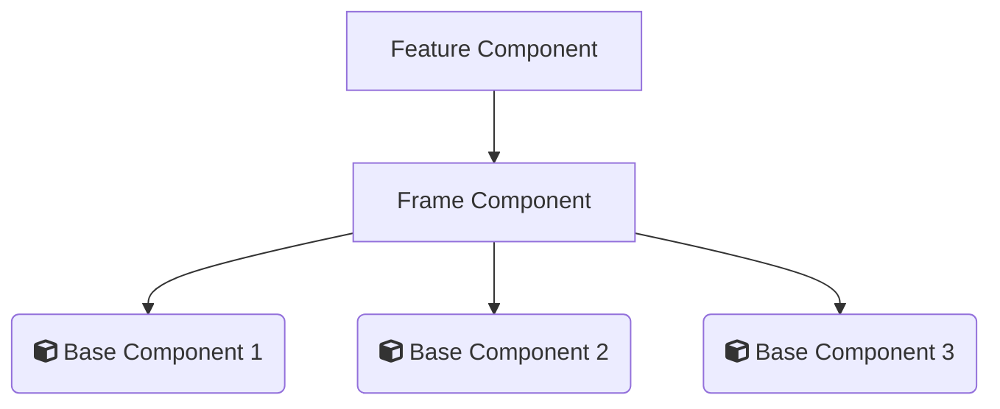

# Component Documentation

_taken from lwc-core documentation_ [[lwc-core]](https://github.com/initdotd/lwc-core/tree/master/docs)



## _Feature Components_

-   Is the logic layer of the feature
-   Handles events dispatched by base components
-   Responsible for fetching data, and prepping it for use with the base components (e.g. flattening a JSON response for lightning datatable use)

## _Frame Components_

-   Wrappers for all of your base components
-   Handles the styling for these base components by utilizing LWC slots


## _Base Components_

-   Flexible-generic components that function agnostically of any single feature
-   “dumb” in that they handle component behavior only, not business logic

<br>

_Example of a Feature.html_

```html
<template>
    <c-frameHdr settings={settings}>
        <c-base-search-bar onfilterlistbysearch={handleSearch} list={data} slot="searchbar"></c-base-search-bar>
        <c-base-date-range onfilterlistbydate={handleDate} list={data} field="dob" slot="daterange"></c-base-date-range>
        <c-base-datatable-custom-types data={displayData} columns={columns} key-field="id" slot="datatable"></c-base-datatable-custom-types>
        <c-base-pagination onpagechange={handlePageChange} list={data} slot="pagination"></c-base-pagination>
    </c-frameHdr>
</template>
```

<br><br>

## _Detailed Frame Documentation_

Custom designed frame component to meet the needs of HDR components.

### Available Slots

```js
slot = "searchbar";
slot = "daterange";
slot = "datatable";
slot = "pagination";
```

Assign the slots in the _Base Components_ referenced in the _Feature Component_ like this

```html
<c-base-search-bar onfilterlistbysearch={handleSearch} list={data} slot="searchbar">
</c-base-search-bar>
```

### Attributes

```html
<c-frame-hdr settings={settings}>
    <!-- these settings determine the Title of the LWC Card & the Icon used -->
</c-frame-hdr>
```

```js
settings = {
    title: "Users HDR Component",
    icon: "standard:account"
};
```

<br><br>

## _Detailed Base Documentation_

### Base Search Bar

Based on the input, the flattened data (array with depth of 1 level) is filtered and returned to a custom event

```html
<c-base-search-bar
	onfilterlistbysearch={handleSearch}
	list={data}
    props-to-search={properties}
	slot='searchbar'
></c-base-search-bar>
```
<br>

`onfilterlistbysearch={handleSearch}` 
- returns results in `event.detail`

<br>

`list={data}`
- a flattened data array (no nested properties)
- if needing to flatten, create a js function specific to your data structure

<br>

`props-to-search={properties}`
- (optional) specified fields in data to search thru
- example: 
```js
props = ['title', 'author'];
```

<br>

`slot='searchbar'`
- slot on frame component for styling & positioning

<br><br>

### Base Empty State 

```html
<c-base-empty-state
    type="treasure" 
    msg={labels.noResultsMessage} 
    sub-msg={labels.noResultsSubMessage}
></c-base-empty-state>
```

<br>

`type="treasure"` 

Empty State Illustration Options, taken from: https://www.lightningdesignsystem.com/components/illustration/
- axe
- balloon / noConnection
- desert
- fish
- rain
- stopsign
- treasure / noresults
- if left empty, a default state will be shown

<br>

`msg={labels.noResultsMessage}`
- can handle a string or variable

<br>

`sub-msg={labels.noResultsSubMessage}`
- can handle a string or variable

<br><br>

example labels object

```js
labels = {
    noResultsMessage : 'No Results Found',
    noResultsSubMessage : 'Refine your search and try again'
}
```